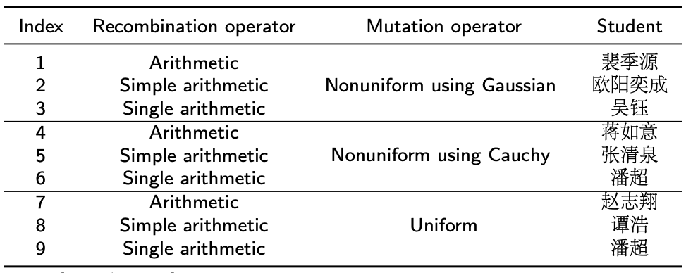
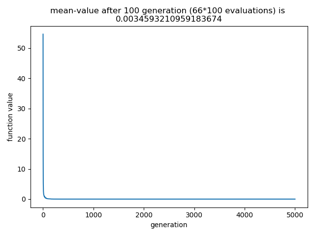
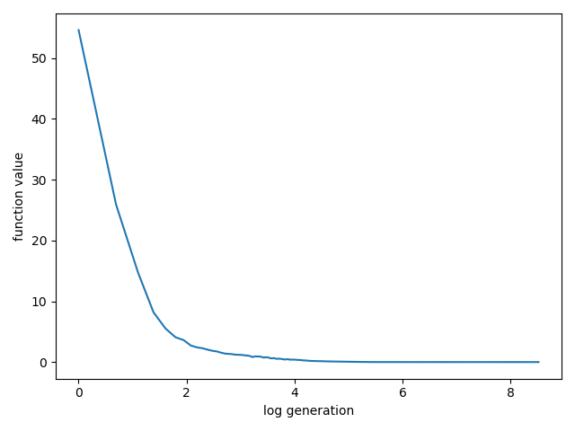
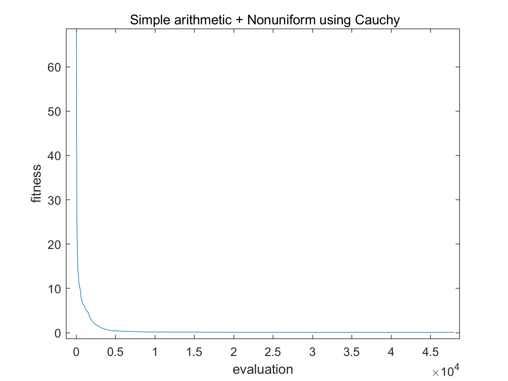
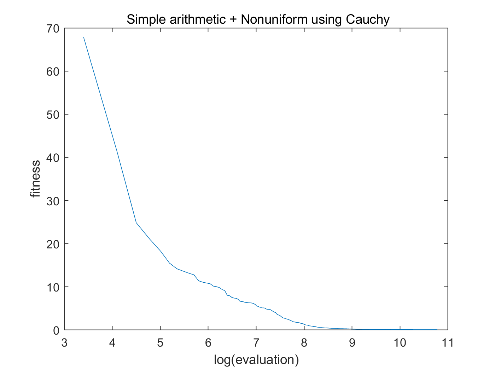
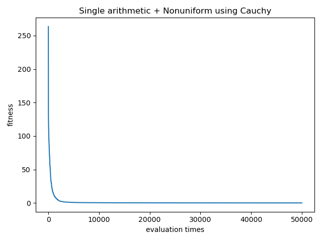
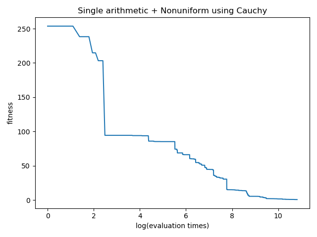
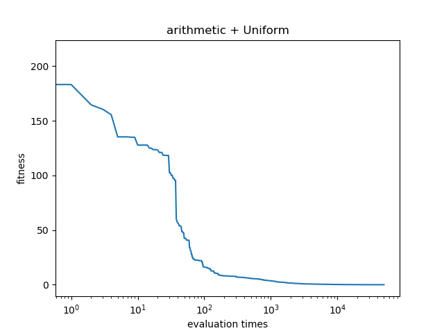
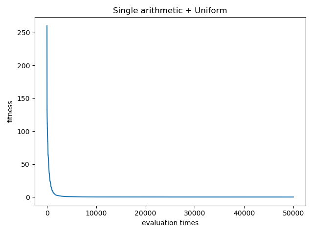
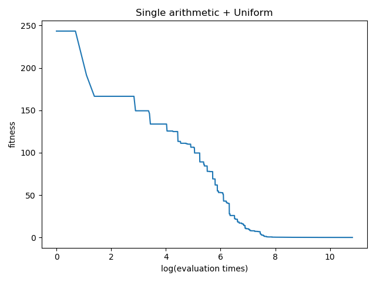

# Compare Evolutionary Operators for Real-valued Representation

## Task
* Implement EAs with different crossover and mutation operators for optimising the [Noisy Quartic Function](http://benchmarkfcns.xyz/benchmarkfcns/quarticfcn.html).
* Compare their performance on the given function using same setting as in **yao1999evolutionary**:
  * Population size 30.
  * Maximum function evaluation 500,000.
  * Repeat 50 independent runs.
* Present the analysed results, discussion and conclusion in this *README.md*.
* Each student will use a different combination (crossover,mutation).




## Results and Discussions

### 1. Jiyuan Pei

### 2. Yicheng Ouyang

### 3. Yu Wu
Evaluate 33 times at the beginning of each selection, and generate 2*mu offsprings. After that, evaluate 33 times to pick up the best mu offsprings.

MIN = -1.28   
MAX = 1.28   
N = 30   
POPULATION_SIZE = 30   
MAX_EVALUATION = 5000*66 = 330000
REPEAT_TIMES = 5  



### 4. Ruyi Jiang

### 5. Qingquan Zhang

MIN = -1.28   
MAX = 1.28   
N = 30   
POPULATION_SIZE = 30   
GAMMA = 0.05   
ALPHA = 0.4   
MAX_EVALUATION = 50000   
REPEAT_TIMES = 10   
CROSSOVER_RATE = 0.5   
MUTATION_RATE = 0.5    





### 6. Chao Pan
MIN = -1.28   
MAX = 1.28   
N = 30   
POPULATION_SIZE = 30   
GAMMA = 0.05   
ALPHA = 0.4   
MAX_EVALUATION = 50000   
REPEAT_TIMES = 10   
CROSSOVER_RATE = 0.5   
MUTATION_RATE = 0.5    



### 7. Zhixiang Zhao
MIN = -1.28
MAX = 1.28
N = 30
POPULATION_SIZE = 30
GAMMA = 0.1
ALPHA = 0.4
UNIFORM_MUTATION_RATE = 1 / N
MAX_EVALUATION = 50000
REPEAT_TIMES = 10

CROSSOVER_RATE = 0.5
MUTATION_RATE = 0.5



### 8. Hao Tan

### 9. Chao Pan
MIN = -1.28   
MAX = 1.28   
N = 30   
POPULATION_SIZE = 30   
GAMMA = 0.05   
ALPHA = 0.4   
UNIFORM_MUTATION_RATE = 1 / N   
MAX_EVALUATION = 50000   
REPEAT_TIMES = 10   
CROSSOVER_RATE = 0.5   
MUTATION_RATE = 0.5   



## Conclusions

## Reference: 

**yao1999evolutionary**
```
@article{yao1999evolutionary,
  title={Evolutionary programming made faster},
  author={Yao, Xin and Liu, Yong and Lin, Guangming},
  journal={IEEE Transactions on Evolutionary computation},
  volume={3},
  number={2},
  pages={82--102},
  year={1999},
  publisher={IEEE}
}
```
